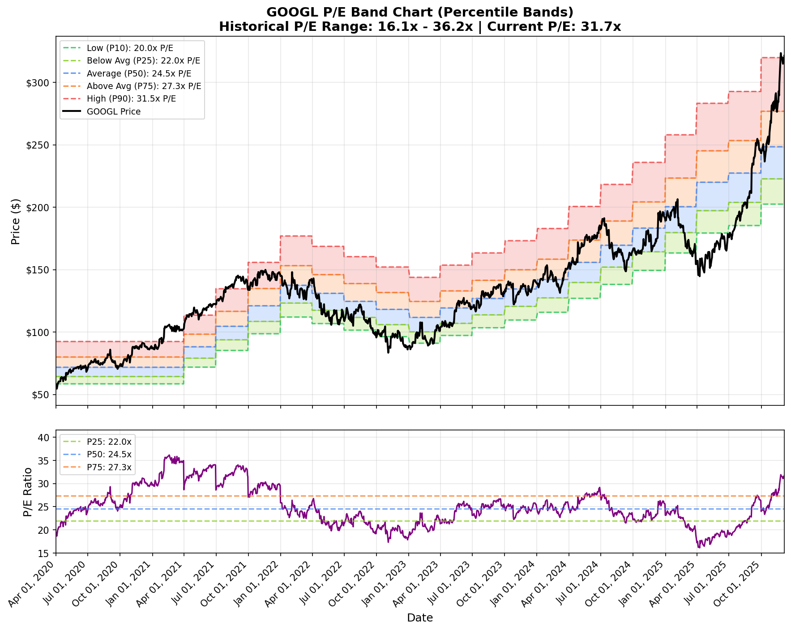

# VI-Scanner

**A Value Investing CLI tool for analyzing stock valuations.**

## Why This Matters (For Non-Finance Folks)
Think of this tool as a "fair price detector" for stocks. Just like you wouldn't pay $10 for a $2 carton of milk, you shouldn't overpay for stocks. This tool looks at a company's history to tell you if its current price is "cheap" (on sale), "fair", or "expensive" relative to its own past.

## Quick Start

1. **Install:**
   ```bash
   pip install -e .
   ```

2. **Run:**
   ```bash
   vi-scanner GOOGL
   ```
   *Output: Generates a chart `{SYMBOL}_pe_band_chart.png` and prints valuation stats.*



## Features
- **P/E Band Analysis**: Visualizes if a stock is trading at a historical discount or premium.
- **Dual Modes**: Analyze using Percentiles (default) or Standard Deviations.
- **Flexible Data**: Works out-of-the-box with Yahoo Finance (free).
- **Extensible**: Supports Financial Modeling Prep API for deep historical data (5+ years).

## Usage

**CLI Commands:**
```bash
vi-scanner NVDA                    # Default analysis
vi-scanner MSFT --years 5          # Analyze last 5 years
vi-scanner TSLA --mode stddev      # Use Standard Deviation bands
```

**Python Library:**
```python
from pe_band_analyzer import analyze_stock_pe_band

result = analyze_stock_pe_band("GOOGL")
print(f"Fair Value: ${result.pe_stats.p50:.2f}")
```

## Configuration (Optional)
For 5+ years of data, get a free [Financial Modeling Prep API Key](https://site.financialmodelingprep.com/developer/docs) and set it:
```bash
export FMP_API_KEY=your_key_here
```

## Project Structure
- `pe_band_analyzer/`: Main package source.
  - `analyzer.py`: Core orchestration logic.
  - `visualization.py`: Charting code.
  - `api/`: Clients for Yahoo Finance & FMP.

## Disclaimer
For educational purposes only. Not financial advice.
